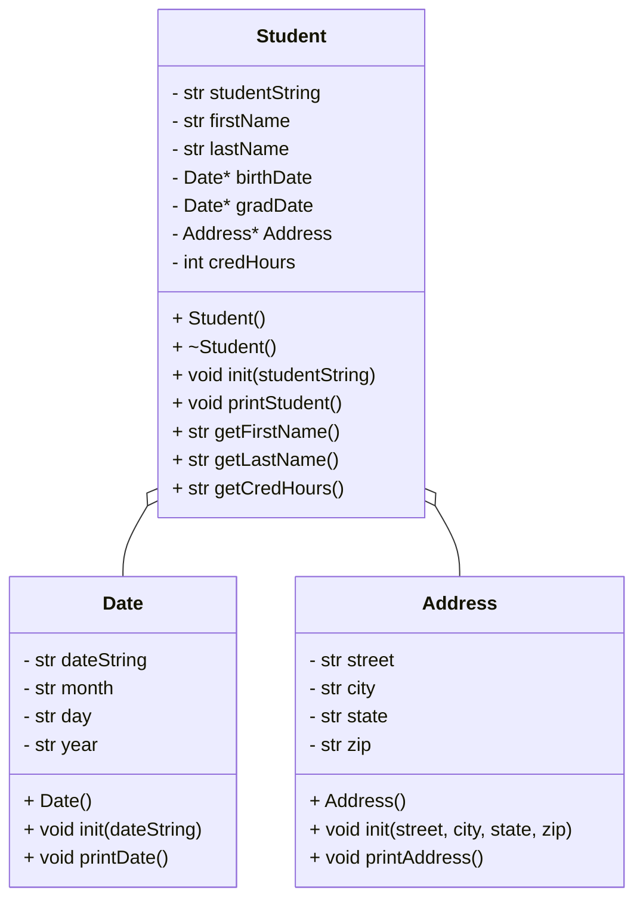

# HeapofStudentsLabF25

# UML Diagram

# Algorithm
# Address Class
private
string street
string city
string state
string zip

parse by ","

public
Address()
void init(street, city, state, zip)

void printAddress(){
    print street << endl << city << state << ", " << zip << endl
}

# Date Class
private
string dateString
string month
stirng year

parse by "/"

public
Date()
void init(dateString)

void printDate(){
    if (month == 01)
        month = January
    elif (month == 02)
        month = February
    elif (month == 03)
        month = March
    elif (month == 04)
        month = April
    elif (month == 05)
        month = May
    elif (month == 06)
        month = June
    elif (moth == 07)
        month = July
    elif (month == 08)
        month = August
    elif (month == 09)
        month = September
    elif (month == 10)
        month = October
    elif (month == 11)
        month = November
    elif (month == 12)
        month = December
    else
        month = "Invalid Month"

    print month << day << ", " << year
    
}

# Student Class
private
string studentString
string firstName
string lastName
Date* birthDate
Date* gradDate
Address* Address
int credHours

public
Student()
~Student() // deconstructure 
void init(studentString)
void printStudent(){
print firstName << lastName << address << "DOB: " << birthDate << "Grad: " << gradDate << "Credits: " << credHours
}

string getFirstName()

string getLastName()

string getCredHours()

# Main file

// don't forget to include <vector>

loadStudents(students vector)
    create an ifstream for infile
    create a string for current line
    
    open students.csv using inFile
    
    while(getline(inFile, currentLine))
        read each line into current line
        create a new instance of Students on the heap
        call student init using currentLine    
        push student to back of vector // use pushback function
        close file

printStudents(students vector)
    create a reference to the student vector
    loop through the student vector
        call printStudent from student class

showStudentNames(students vector)
    create a reference to the student vector
    loop through student vector
        call getLastFirst from student class

findStudent(students vector)
    create a reference to the vector of students
    create a string target
    create a bool for notFound set to true
    ask user for last name and store that in target
    loop through all students
        use string.find method
        if it's found
            call printStudent from student class
        if not found
            print "Student not found"

delStudents(students vector)
    loop through student vector
        delete the element

menu()
    print 0) quit, 1) print all student names, 2) print all student data, 3) find student
    ask user to type 0-3
    if input == "0" 
        exit the program
        call deleteStudents() // unsure if I have to do this here or in main
    elseif input == "1"
        call showStudentNames
    elseif input == "2"
        call printStudents()
    else input == "3"
        call findStudent

main()
    create the student vector 
    call loadStudents()
    call menu()
    call deleteStudents()

