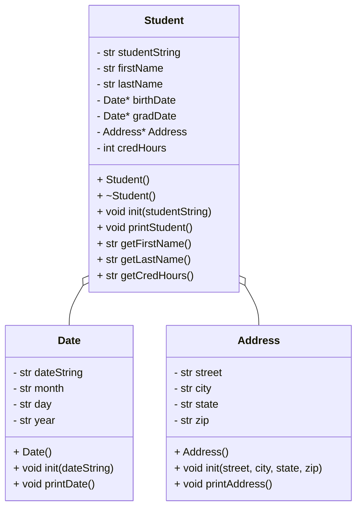

# HeapofStudentsLabF25

# UML Diagram

# Algorithm
# Address Class
private
string street
string city
string state
string zip

parse by ","

public
Address()
void init(street, city, state, zip)

void printAddress(){
    print street << endl << city << state << ", " << zip << endl
}

# Date Class
private
string dateString
string month
stirng year

parse by "/"

public
Date()
void init(dateString)

void printDate(){
    if (month == 01)
        month = January
    elif (month == 02)
        month = February
    elif (month == 03)
        month = March
    elif (month == 04)
        month = April
    elif (month == 05)
        month = May
    elif (month == 06)
        month = June
    elif (moth == 07)
        month = July
    elif (month == 08)
        month = August
    elif (month == 09)
        month = September
    elif (month == 10)
        month = October
    elif (month == 11)
        month = November
    elif (month == 12)
        month = December
    else
        month = "Invalid Month"

    print month << day << ", " << year
    
}

# Student Class
private
string studentString
string firstName
string lastName
Date* birthDate
Date* gradDate
Address* Address
int credHours

public
Student()
~Student() // deconstructure 
void init(studentString)
void printStudent(){
print firstName << lastName << address << "DOB: " << birthDate << "Grad: " << gradDate << "Credits: " << credHours
}

string getFirstName()

string getLastName()

string getCredHours()
